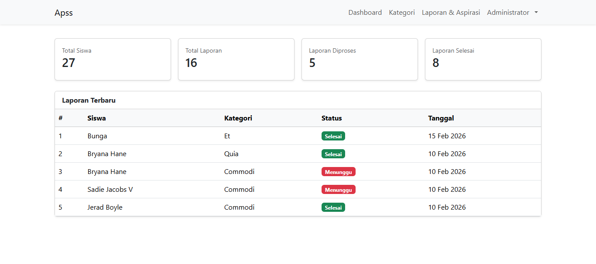

# Aplikasi Pengaduan Sarana Sekolah

Aplikasi Pengaduan Sarana Sekolah merupakan sistem berbasis web yang dibuat untuk mempermudah proses penyampaian laporan atau pengaduan terkait kondisi sarana dan prasarana di lingkungan sekolah. Sistem ini dirancang untuk membantu siswa, guru, maupun pihak sekolah dalam melaporkan kerusakan fasilitas secara cepat dan terorganisir.

## Fitur Aplikasi
- Form pengaduan fasilitas sekolah
- Dashboard admin
- Manajemen data laporan pengaduan
- Monitoring status pengaduan
- Pengelolaan data pengguna

## Teknologi yang Digunakan
- Laravel
- PHP
- MySQL
- Bootstrap

## Tujuan Sistem
Aplikasi ini dibuat untuk menggantikan proses pelaporan kerusakan fasilitas yang sebelumnya dilakukan secara manual. Dengan sistem berbasis web, laporan pengaduan dapat dikirim dan dikelola dengan lebih cepat, terdokumentasi dengan baik, serta mempermudah pihak sekolah dalam menindaklanjuti setiap laporan yang masuk. Sistem pengaduan berbasis web juga dapat meningkatkan efisiensi dan transparansi dalam pengelolaan fasilitas sekolah. :contentReference[oaicite:0]{index=0}

## Repository
Source code aplikasi tersedia di:
https://github.com/Bunga80/Aplikasi-Pengaduan-Sarana-Sekolah

## Tampilan Aplikasi

## Developer
Bunga Amelia
